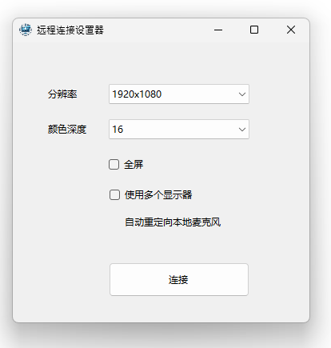

# RDPHelper
 
# 快速 RDP 连接工具

这个工具旨在提供一种快速且便捷的方法帮你自动修改你的RDP文件（通过 F5 APM Webtop 连接到远程服务器时下载的RDP文件），并自动将本地音频映射到远程桌面上。

## 界面预览

## 功能特点

- 支持通过 F5 BIG-IP APM 提供的 RDP 文件快速配置和连接远程桌面。
- 自动映射本地音频到远程桌面。
- 提供窗口设置和其他连接配置的选项。

## 使用指南

1. **下载 RDP 文件**:
   - 通过 F5 提供的服务在您的浏览器中下载用于连接的 RDP 文件。

2. **配置连接选项**:
   - 打开本程序。
   - 选择窗口设置和其他配置选项，如下图所示。

3. **启动连接**:
   - 点击“连接”按钮，程序将自动为您配置并启动远程桌面会话，同时将本地音频映射到远程服务器。

## 支持和反馈

如果您在使用过程中遇到任何问题，或有任何反馈和建议，请联系我们的支持团队。
